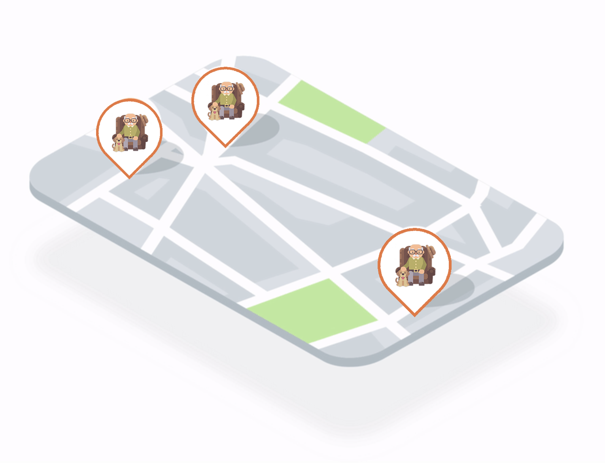

# VoloSpesa | FlyinGroceries

</img>

### Italian version: [VoloSpesa](https://volospesa.herokuapp.com)

### English version: [FlyinGroceries](https://flyingroceries.herokuapp.com)

##

_This project was born during the Covid-19 lockdown in Milan, Italy, and was developed together with [Andrea Carotti](https://github.com/andreacarotti99) as a way to help our local volunteering community._

### _Want to know more? Read [the article](https://www.nicolasracchi.com/blog/volospesa) on my blog about this project_

### We enable volunteers in your area to bring groceries to people in need during COVID lockdown

</img>

## Usage

If you want to run this web app locally, just follow these steps:

```bash
# clone repository
git clone https://github.com/nicolas-racchi/VoloSpesa

# install dependencies and run devleopment server
cd Volospesa/client && npm install
cd ../server && npm install
cd .. && npm run dev
```

# Here's the whole story:

## INSPIRATION

We wondered what was a way to have an impact during the Covid-19 lockdown in our local community, so we contacted friends who make services of volunteering in our area, and it emerged that the organization of these services could take advantage of a logistical improvement. This was the goal of our idea.

## WHAT IT DOES

FlyinGroceries is made for two different kinds of users: volunteers and people who have difficulties going outside.
If you need someone to deliver your groceries for health reasons, you can make an order in a few clicks (we focused a lot on the ease of use!) and it will appear on the map. If you're a volunteer, you can consult the map and see if there's someone in your area that needs help. Then, you can consult their grocery list and contact them by phone to arrange the delivery.

## HOW WE BUILT IT

Our project is divided into 3 separate parts.

1. The client - a web app that runs both on mobile and desktop
2. The app - for both iOS and Android (not released yet)
3. The backend - A node.js server handling requests for both the web app and the mobile app.

## CHALLENGES WE RAN INTO

One of the most difficult tasks was making this project easy to use for everyone. We want people of all ages to benefit from this volunteer service.

## ACCOMPLISHMENTS THAT WE'RE PROUD OF

We are really proud of how we managed to get both a mobile and web version of this app and we can't wait to publish the official mobile app to the respective stores.

## WHAT WE LEARNED

We learned to bring quickly to production a web and mobile application interacting with third parties API, improved our design skills, and organizing ourselves in a way that we could approach this kind of challenges systematically in future.
Taking part to an online Hackathon pushes you to interact with the people you are working with in new ways, using technologies for sharing ideas and fixing problems with other's help virtually.
More technically speaking we deepened our knowledge in asynchronous functions and accessing remote servers from various clients.

## WHAT'S NEXT

we are already making contact with voluntary association in Milan, hoping that the service before being launched on global level could be tested first by volunteers, then, since FlyinGroceries is a non-profit platform, with the help of socially involved influencers committed to the cause we could reach a broader audience.

##EXTRA FEATURES WE'RE WORKING ON
We are figuring out ways to hide the phone number of people that make orders. For now, the only reason this feature isn't present is that we are on a tight budget. Another useful feature we are adding is the possibility for volunteers to receive notifications in the app when an order has been submitted near them.
